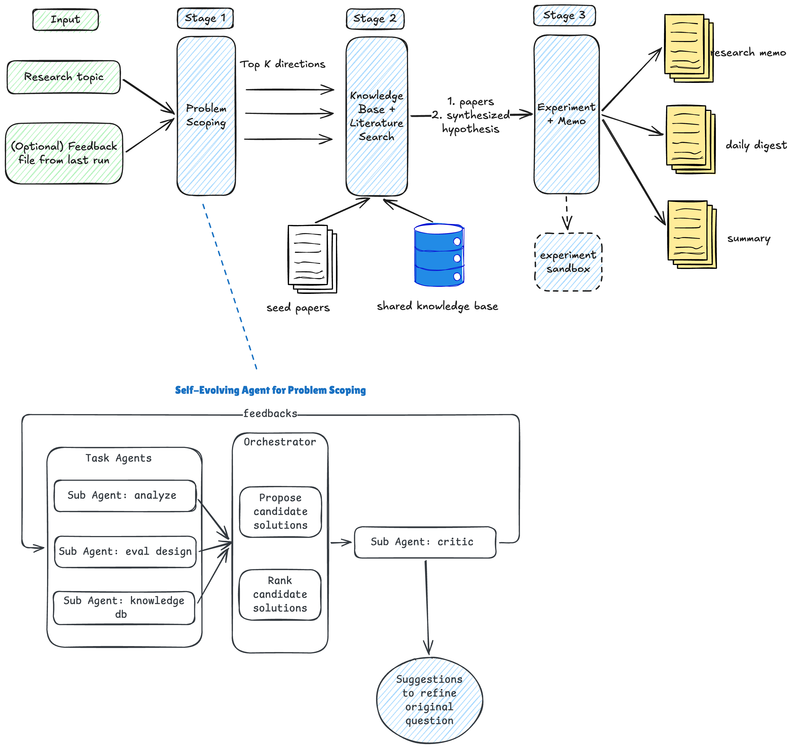
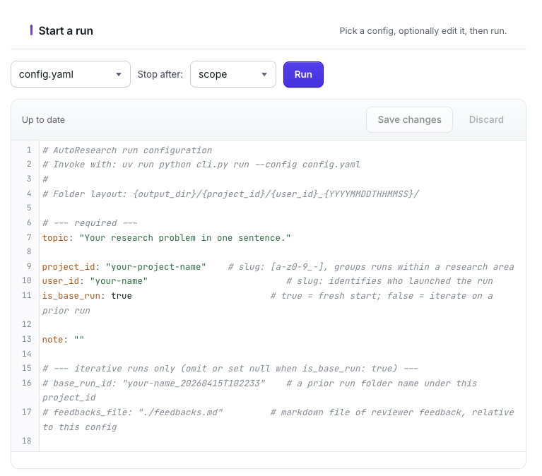
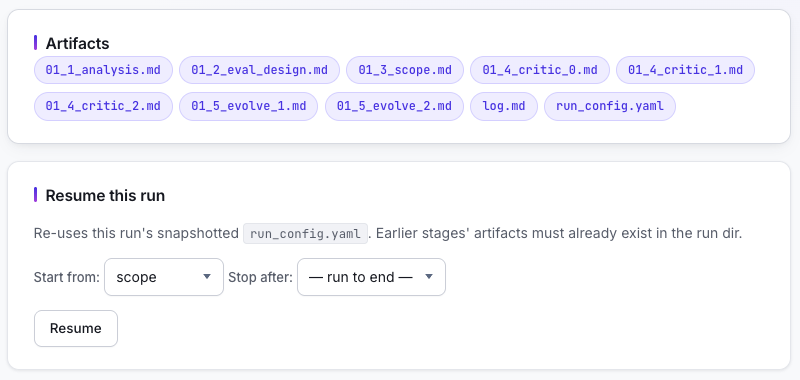

<p align="center">
  
</p>

# AutoResearch

Autonomous research assistant. Given a topic and a small set of reference papers, AutoResearch scopes the problem (with a critic-evolve loop), runs a literature search, designs and executes experiments, and writes a 2-page mini-paper plus a one-page executive summary end-to-end.

***Note***: this repo is the shell testing version for the labs (design partners) we're collaborating with. It doesn't contain the full code. Licensed research groups have access to the docker image of this product. 

<p align="left">
  
</p>


## Setup

You'll need Docker and pull access to the AutoResearch image (granted by your contact via a GitHub Personal Access Token with `read:packages` scope).

```bash
# 1. Install Docker
#    macOS:  brew install --cask docker  (then launch Docker.app once)
#    Linux:  https://docs.docker.com/engine/install/

# 2. Authenticate against the AutoResearch image registry
docker login ghcr.io
#   username: your GitHub username
#   password: the PAT shared with you (read:packages scope)

# 3. Set your API key
cp .env.example .env
vim .env            # paste your ANTHROPIC_API_KEY=sk-ant-...
```

That's it. The pipeline + orchestration code lives inside the Docker image; you don't install Python or any deps locally.

## Quick start

All commands below use `./run.sh`, the wrapper in this repo that pulls the Docker image and mounts your local `prompts/`, `config*.yaml`, `knowledge_base/`, and `research_runs/` into the container. You never write `docker run` by hand.

### Step 1. List your reference papers

Edit `knowledge_base/references.json` — a flat JSON list of paper URLs:

```json
[
  "https://bitvm.org/bitvm.pdf",
  "https://eprint.iacr.org/2025/1485.pdf"
]
```

Max 10 URLs per run (hard cap — raise via `scope_kb_max_papers` in the config).

### Step 2. Build the knowledge base

The first time you run the pipeline, the scope stage automatically fetches every URL in `references.json`, markdownifies the paper body, and extracts metadata via the LLM. Output lands in `knowledge_base/index.json` + `knowledge_base/raw/<slug>.{pdf,html,md}`. Subsequent runs reuse the cache — already-indexed URLs are skipped.

You don't need to run any command here; just save `references.json` and proceed.

> You can also run an explicit `./run.sh build-kb` to pre-warm the cache before running the pipeline (faster than letting scope stage do it inline). See "Manual build" under Knowledge Base.

### Step 3. Edit `config.yaml`

You can use the current `config.yaml` file as your starting point. See "Configuration" section below for all the parameters you can use and their explanations.  

```yaml
# AutoResearch run configuration
# Invoke with: uv run python cli.py run --config config.yaml
#
# Folder layout: {output_dir}/{project_id}/{user_id}_{YYYYMMDDTHHMMSS}/

# --- required ---
topic: "Your research problem in one sentence."

project_id: "your-project-name"    # slug: [a-z0-9_-], groups runs within a research area
user_id: "your-name"                          # slug: identifies who launched the run
is_base_run: true                          # true = fresh start; false = iterate on a prior run

note: ""

# --- iterative runs only (omit or set null when is_base_run: true) ---
# base_run_id: "your-name_20260415T102233"    # a prior run folder name under this project_id
# feedbacks_file: "./feedbacks.md"         # markdown file of reviewer feedback, relative to this config

# --- model ---
model: "claude-opus-4-7"

# --- knowledge base ---
references: "./knowledge_base/references.json"
scope_kb_max_papers: 10
scope_kb_max_chars_per_paper: 40000

# --- stage 2 tunables (optional; defaults shown) ---
lit_results_per_query: 5    # raw hits pulled per web_search query before dedupe
lit_top_n: 20                # ranked survivors kept for synthesis

# Global default for every LLM call (default 4096)
max_tokens: 16384

# --- experimentation Codegen + patch override — needs more room because experiment code is long ---
# (default 8192). Bump if codegen reports "hit max_tokens" truncation.
exp_codegen_max_tokens: 16384
exp_timeout_sec: 500
exp_max_retries: 3

```

### Step 4. Run the pipeline

You can choose to run from the CLI or the Web UI. If you prefer to run using web UI, directly proceed to Step 5. Even if you run from CLI, you can still use UI to inspect and Markdown files - may provide you with better UX. 

```bash

# Scope only — fast feedback loop when iterating on the topic / prompts
./run.sh run --config config.yaml --stop-after scope

# Resume from a specific stage on an existing run
./run.sh run --config config.yaml \
  --resume <user_name>_20260521T143000 \
  --start-from literature

# If you are confident of AI gets scoping correctly, directly do the Full run
./run.sh run --config config.yaml
```

Outputs land in `research_runs/<project_id>/<user_id>_<timestamp>/`. Refer to section #Output artifacts below for descriptions of all output files. 

### Step 5. Use the web UI

```bash
./run.sh serve            
# → open http://127.0.0.1:8000
```

The dashboard lets you pick a config, edit it inline (YAML syntax highlighting), launch runs, watch the live log stream, browse rendered artifacts, and spawn iterative runs from a feedback textarea — all without leaving the browser.

Just like in CLI, we suggest running scope step first, for early intervention if you're not contented with the direction. 

<p align="left">
  
</p>

Then you can also resume from web 

<p align="left">
  
</p>

### References file location

By convention the system auto-discovers `knowledge_base/references.json` next to your config. Override with the `references:` field in your config if you keep your KB elsewhere (e.g. shared across projects).

## Knowledge base

The knowledge base is the set of reference papers the scope stage feeds into every sub-agent (analysis, eval_design, scope orchestrator, critic, evolve). All you maintain is `references.json` — a flat list of URLs.

### Auto-build on scope-stage run

When stage_scope runs, it reads `references.json` and for each URL not yet in `index.json`:

1. Fetches the URL (PDF or HTML)
2. Markdownifies the body to `raw/<slug>.md`
3. Calls the LLM with `prompts/kb_extract.md` to extract metadata
4. Appends an entry to `index.json`

Already-indexed URLs are skipped. So `references.json` is the only file you edit; the system handles the rest.

### Manual build 

You can pre-warm the cache before running the pipeline:

```bash
# Default knowledge_base/
./run.sh build-kb

# A different directory (e.g. per-project KB)
./run.sh build-kb --kb-dir bitcoin_kb

# Re-extract everything (ignore cache)
./run.sh build-kb --force
```

### Constraints

- **Max 10 papers** per `references.json` by default — the scope stage hard-fails if more. Raise with `scope_kb_max_papers` (see below). The cap exists because every sub-agent sees the full markdown of every paper.
- **40k chars per paper** — papers longer than this get truncated with a `[...TRUNCATED]` marker (and an alert in the log). Raise with `scope_kb_max_chars_per_paper` if your papers are dense.
- **Caching**: the KB is injected as a `cache_control: ephemeral` system block in every sub-agent call. First call writes the cache (~~125% input price for that block); subsequent calls within 5 minutes read it (~~10% price). Roughly 3× cheaper than passing it uncached.

## Configuration

Required fields must be set explicitly; optional fields fall back to the defaults below.

### Required


| Field         | Type   | Default | Description                                                                                                                     |
| ------------- | ------ | ------- | ------------------------------------------------------------------------------------------------------------------------------- |
| `topic`       | string | —       | Describe the research problem. There's no character limit but you may want to limit it to a few paragraphs. This field is critical to the quality of the research agent. Drives every downstream stage.                                                            |
| `project_id`  | slug   | —       | Groups runs of the same research area. Allowed chars: lowercase letters, digits, `_`, `-`. Must start and end alphanumerically. |
| `user_id`     | slug   | —       | Identifies who launched the run. Same slug rules. Folder names embed this: `research_runs/<project_id>/<user_id>_<timestamp>/`. |
| `is_base_run` | bool   | —       | `true` = fresh run; `false` = iterative run (then `base_run_id` + `feedbacks_file` are required).                               |
| `note`        | string | —       | Free-text note shown in the scope artifact's header. Use `""` if none. Good for tagging a run with a short reminder. For example, if you're tuning learning rate, you can tag the lr you're trying here.             |


### Iterative run only (omit when `is_base_run: true`)


| Field            | Type   | Default | Description                                                                                                                                                                |
| ---------------- | ------ | ------- | -------------------------------------------------------------------------------------------------------------------------------------------------------------------------- |
| `base_run_id`    | string | —       | Run folder name to iterate on. Accepted shapes: leaf (`<user>_20260508T132542`), project-qualified (`<project_id>/<leaf>`), or full path (`<output_dir>/<project_id>/<leaf>`). |
| `feedbacks_file` | path   | —       | Path to a markdown file containing reviewer feedback. Each stage reads its prior artifact + this file to produce a refined version.                                        |


### Knowledge base


| Field                          | Type | Default                            | Description                                                                                                                                                                       |
| ------------------------------ | ---- | ---------------------------------- | --------------------------------------------------------------------------------------------------------------------------------------------------------------------------------- |
| `references`                   | path | `./knowledge_base/references.json` | Path to `references.json` (flat JSON list of paper URLs). Auto-discovered if omitted. Set explicitly only when the KB lives elsewhere (e.g. shared across projects).              |
| `scope_kb_max_papers`          | int  | `10`                               | Hard ceiling on URLs in `references.json`. Scope stage fails BEFORE fetching if exceeded. Default assumes 10 papers × 40k chars ≈ 100k tokens injected into every sub-agent call. |
| `scope_kb_max_chars_per_paper` | int  | `40000`                            | Per-paper char cap when injecting markdown into sub-agent prompts. Longer papers are head-truncated with a `[...TRUNCATED]` marker and a log alert.                               |


### Model


| Field        | Type   | Default           | Description                                                                                                                                                                                        |
| ------------ | ------ | ----------------- | -------------------------------------------------------------------------------------------------------------------------------------------------------------------------------------------------- |
| `model`      | string | `claude-opus-4-6` | Anthropic model for the main pipeline (scope, rank, synth, experiment). Stage 2 also spins up Haiku for cheap query-gen + web search regardless. Examples: `claude-opus-4-7`, `claude-sonnet-4-6`. |
| `max_tokens` | int    | `4096`            | Default per-call output cap. Codegen uses `exp_codegen_max_tokens` instead. Raise for stages that emit long markdown (memo, summary); lower to enforce conciseness.                                |


### Output


| Field        | Type | Default           | Description                                                                                          |
| ------------ | ---- | ----------------- | ---------------------------------------------------------------------------------------------------- |
| `output_dir` | path | `./research_runs` | Where run folders are written. Each run lands at `<output_dir>/<project_id>/<user_id>_<timestamp>/`. |


### Stage 2 — Literature search


| Field                   | Type | Default | Description                                                                                                           |
| ----------------------- | ---- | ------- | --------------------------------------------------------------------------------------------------------------------- |
| `lit_results_per_query` | int  | `10`    | Raw web-search hits pulled per query before dedupe. Lower to save tokens; raise for broader coverage of niche topics. |
| `lit_top_n`             | int  | `12`    | Ranked survivors fed into the synthesis call. Drives the size of the final `02_literature.md`.                        |


### Stage 3 — Experiment


| Field                    | Type | Default | Description                                                                                                                                                      |
| ------------------------ | ---- | ------- | ---------------------------------------------------------------------------------------------------------------------------------------------------------------- |
| `exp_timeout_sec`        | int  | `300`   | Wall-clock budget (seconds) for ONE attempt of the generated experiment subprocess. On timeout, the self-heal loop feeds the traceback back for a patch.         |
| `exp_max_retries`        | int  | `3`     | Self-heal attempts before giving up. Each retry costs one LLM patch call plus one subprocess run.                                                                |
| `exp_codegen_max_tokens` | int  | `32768` | Per-call output cap for codegen + patch (separate from `max_tokens` because experiment code is long and easy to truncate mid-file). Sonnet supports up to 64000. |


## Pipeline stages


| #   | Stage          | Output                                                                            |
| --- | -------------- | --------------------------------------------------------------------------------- |
| 1   | **Scope**      | `01_*.md` — analysis, eval_design, scope, with critic/evolve iterations (up to 3) |
| 2   | **Literature** | `02_literature.md` — annotated bibliography + gap analysis                        |
| 3   | **Experiment** | `03_experiment/{run.py, analysis.md, ...}` + `04_memo.md` (mini paper)            |
| 4   | **Summary**    | `00_summary.md` — executive briefing at the top of the run folder                 |


## Output artifacts — what's in a run folder

After a run completes, `research_runs/<project>/<user_name>_<timestamp>/` contains the files below. Start with `00_summary.md`.


| Stage         | File                               | Description                                                                                                                      |
| ------------- | ---------------------------------- | -------------------------------------------------------------------------------------------------------------------------------- |
| 1. Scope      | `01_1_analysis.md`                 | Frames the problem before picking solutions — context, constraints, and candidate-archetype space.                               |
| 1. Scope      | `01_2_eval_design.md`              | Evaluation metrics the scope orchestrator will use to compare candidate directions.                                              |
| 1. Scope      | `01_3_scope.md`                    | Orchestrator's proposal: candidate solution directions scored against the metrics, plus the chosen direction with justification. |
| 1. Scope      | `01_4_critic_N.md`                 | Independent 0-10 score of the current scope proposal with structured feedback. One file per critic invocation.                   |
| 1. Scope      | `01_5_evolve_N.md`                 | Refined scope produced in response to the critic's feedback. One file per evolve iteration.                                      |
| 2. Literature | `02_literature.md`                 | Annotated bibliography (10-15 papers) + gap analysis tied to the scope's Key Questions.                                          |
| 2. Literature | `02_suggested_references.json`     | URLs of papers found during search that aren't yet in `knowledge_base/index.json`.                                               |
| 3. Experiment | `03_experiment/exp_plan.md`        | Experiment design: hypothesis, approach, baseline, inputs, metrics, procedure, JSON output schema.                               |
| 3. Experiment | `03_experiment/run.py` (+ helpers) | Generated Python program the code generator emitted. Prints a JSON metrics object to stdout as its last line.                    |
| 3. Experiment | `03_experiment/metrics.json`       | Raw JSON metrics from the final successful run. Absent if all attempts failed.                                                   |
| 3. Experiment | `03_experiment/results.csv`        | 2-column `name,value` flattening of `metrics.json` for spreadsheet inspection.                                                   |
| 3. Experiment | `03_experiment/fig_*.png`          | Charts the generated code emitted. At least one per experiment (codegen-mandated).                                               |
| 3. Experiment | `03_experiment/analysis.md`        | Results-focused write-up reading the metrics + charts and interpreting them against the hypothesis.                              |
| 3. Experiment | `03_experiment/run_log.json`       | Per-attempt history: exit code, duration, timed-out flag. Useful when an experiment failed.                                      |
| 3. Experiment | `04_memo.md`                       | 2-page mini-paper at the run-dir top level. Frames the result in context of the original scope.                                  |
| 4. Summary    | `00_summary.md`                    | One-page executive briefing aggregating scope, literature, analysis, memo + cost. Written last, read first.                      |
| (always)      | `log.md`                           | Timestamped event log of every stage transition, LLM call (with token + cost), artifact write, and error.                        |
| (always)      | `run_config.yaml`                  | Snapshot of the YAML config this run was launched with. Makes the run self-describing.                                           |


